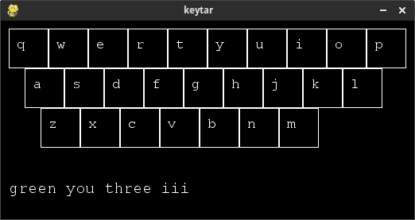

keytar
======
Swipe-style keyboard where users talk and type at the same time, to increase speed and accuracy.

# [VIDEO DEMO](https://youtu.be/PATGRRmMblY)

## Inspiration

Swipe-style keyboards like Swype and Google Keyboard are really fast and efficient. However, they can't easily distinguish between words like _red_ and _reed_, which makes typing those words rather frustrating.

However, _red_ and _reed_ have very different pronunciations. What if we could incorporate pronunciation information in realtime to eliminate these errors?

## What it does

Keytar is a proof-of-concept touch keyboard that integrates speech recognition with swiping in realtime.

The user swipes to enter words, similar to Swype or Google Keyboard. However, as they are swiping, the user also says the word out loud. Voice recognition is performed on the speech, and the swipe and voice information is put together to get very high quality results.

## How I built it

About a year ago, I wrote a library called speech_recognition, which now has many tens of thousands of active users. This provides the speech side of things.

The swipe keyboard demo is written using Python and PyGame. Polling the touch position, we get the trail left behind by the finger. This information is used by a ranking function and an English word list to get the most likely words intended by the user.

Speech recognition is constantly running while the keyboard is active. The results are merged with recently swiped words. That means that speaking can be used to correct the most recently typed word.

## Challenges I ran into

This keyboard is intended for use with mobile phones. For simplicity and ease of development/testing, I chose to make a desktop app.

Additionally, the API-based speech recognition is a bit too slow to match real-world typing speeds, especially on the WiFi in E5. To solve this, I would swap it out for something like PocketSphinx, which has no dependency on network speeds.

## Accomplishments that I'm proud of

The language model is really simple, but it works surprisingly well. Words are scored by their log combined rank and length, and voice and typing are resolved in a really elegant way.

As a proof of concept, I feel that the idea is demonstrated quite well.

## What I learned

I've never used PyGame for this sort of thing before - it's quite nice to work with! Figuring out how swipe-style keyboards work was also very interesting, and my algorithm is likely very different from what currently available swipe keyboards use.

## What's next for Keytar

First, I'd like to try using something like PocketSphinx to make the speech recognition faster.

Then, an improved swipe model is in order. For example, the length of the path that goes through the key, and sudden changes in the swipe direction, should be taken into account.
